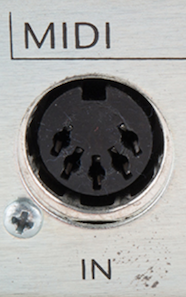
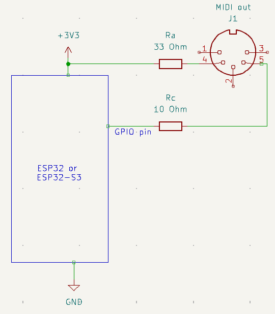
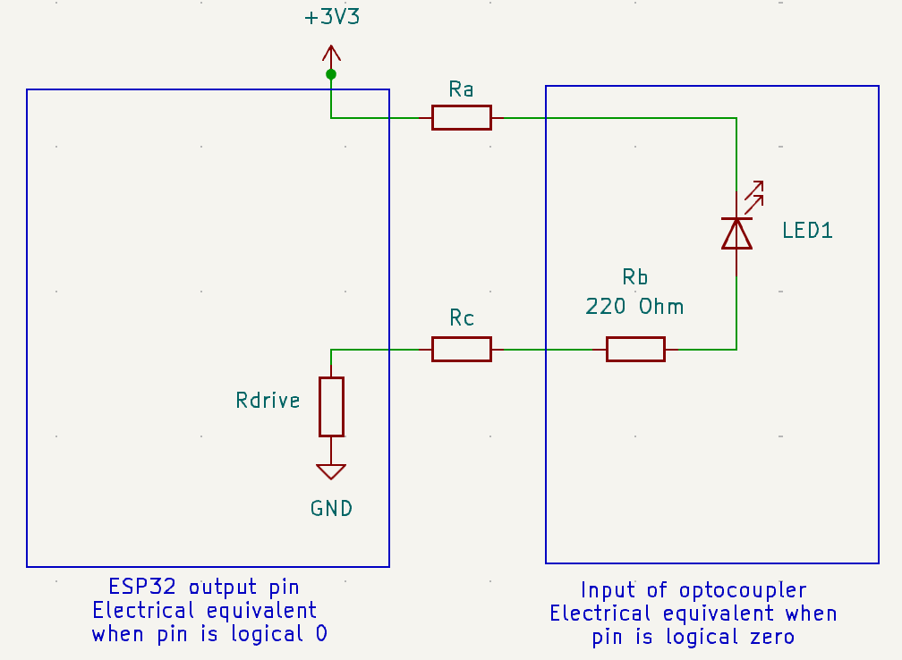

# MIDI over serial output with ESP32 and MicroPython

## Overview

MIDI data can be sent over a serial connection. This is done with 5 pin DIN connectors:



This document explains how to play MIDI files on a ESP32 and drive a sound module with a 5 pin DIN MIDI connector.

All this is valid at least for the ESP32 and the ESP32-S3.

## Parts list

* One 33 Ohm resistor
* One 10 Ohm resistor
* One 5 contact DIN male connector

You also can connect the ESP32 to a female connector and use a 5 pin DIN male to male cable to connect to the sound module.


## MIDI over serial line DIN connector

The MIDI signal over a DIN connector needs no current (0 mA) for a logical 1 and 5 mA for a logical 0.

Since the serial protocol is normally on (i.e. transmitting logical 1), while idle no current is needed.

## Circuit

The circuit to connect to MIDI out is this:



You need to connect the GPIO output pin of the ESP32 to R1 = 10 Ohm and then to the pin 2 of the DIN connector, and the 3.3V pin of the ESP32 to the R2 = 33 Ohm pin and to the pin 4 of the DIN connector.

No additional buffer, driver or voltage shifter is needed. The ESP32 GPIO pin supplies more than enough energy to make this work.

Pins 1, 5 and 2 of the MIDI plug are not connected. Pin 2 and shielding is needed if cables are long, see the MIDI standard (link below).

## The receiving end

This is the receiving end of the circuit (i.e. what's behind a ```MIDI in```plug)


There is always Rb, a 220 Ohm resistor on the receiving end to limit current. The diode D1 kicks in when pin 4 and 2 are accidentally reversed to protect the LED. The current drives LED1 in a optocoupler. The purpose of the optocoupler is to isolate this circuit electrically from the rest of the receiver. The optocouplers are normally 6N138, 6N139, PC-900V or H11L1 integrated circuits.

When LED1 has a current of around 5 mA, it will act on a photosensitive device that then switches a current on and off.


## The program

To play back a MIDI file, use this MicroPython code on the ESP32. For the example, the MIDI file needs to be on the root of the ESP32's file system.
```
from machine import UART
from umidiparser import MidiFile

uart = UART( 1, baudrate=31250, tx=10, rx=9 )

for event in MidiFile("my_midi_file.mid").play():
    if event.is_channel():
        uart.write( event.to_midi() )
```
Don't use UART0, it is reserved for the REPL. See the MicroPython docs for the default pins for UART 1 and 2, but you can select the pin you need. For MIDI out, the rx pin is not used but is it reserved anyhow.


## Some tinkering

The ESP32 pins allow to set the drive strength:

| drive= | maximum current | internal resistance
|--------|-----------------|--------------------|
| ```Pin.DRIVE_0```| 5mA | 130 ohm|
| ```Pin.DRIVE_1```| 10mA | 60 ohm|
| ```Pin.DRIVE_2```| 20mA | 30 ohm (default strength if not configured)|
| ```Pin.DRIVE_3```| 40mA | 15 ohm|

The equivalent circuit modelling the drive strength is as follows:



The equivalent circuit is drawn for logical 0, i.e. current is flowing. The typical voltage drop on LED1 is 1.4V and D1 is open (not shown here), so the circuit equation is:

(R<sub>drive</sub> + R<sub>1</sub> + R<sub>2</sub> + R<sub>b</sub>)&times;_I_ + V<sub>LED1</sub> = 3.3

Solving for the current _I_, and setting V<sub>LED1</sub> = 1.4, R<sub>b</sub>=220Ohm

_I_ = 1.9/(R<sub>drive</sub> + R<sub>1</sub> + R<sub>2</sub> + 220)

Here is a little table with the current _I_ for various drive strength and resistors, all with a typical value 1.4V of V<sub>LED1</sub>:

R<sub>1</sub>|R<sub>2</sub>  |Drive|R<sub>drive</sub>|_I_ [mA]|
--|----|-|--|---|
33|10  |2|30|6.5|
33|10  |3|15|6.8|
50|50  |2|30|5.4|
50|50  |3|15|5.7|
100|100|2|30|4.2|
100|100|3|15|4.4|

I found that R<sub>1</sub>=R<sub>2</sub>=100 Ohm and drive=3 works (i.e. should work for almost all MIDI devices) and offers more protection than 33+10 Ohm.

To set the drive strength, this is the MicroPython code:
```
from machine import UART, Pin
uart = UART( 1, baudrate=31250, tx=Pin(10,Pin.OUT,drive=Pin.DRIVE_3, rx=9 )
```

Here is my test setup. I have a (very old) Yamaha QY100 sound module which I used for testing. The microcontroller is a ESP32-S3 on a DEVKIT-C board. Just for precaution, I used an suspect ESP32-S3 too, but I didn't burn anything in the process &#128540;


Wiring goes from pin 10 to the blue 100 Ohm resistor, then to pin 4 (orange) of the DIN connector, pin 2 (white) to the other blue 100 Ohm resistor and (red) back to 3.3V of the microcontroller. The drain on the microcontroller's power converter is minimal, it resists several hundreds of  mA. No special setup was necessary on the QY100, but it has a sliding switch to select the MIDI source which had to be set to MIDI.

So now the sound module is playing back a nice march! (One of my crank organ MIDI files) &#x1F603;&#x1F603;&#x1F603;


## Other stuff

MIDI connections are designed to be very sturdy and to resist a lot of abuse. On stage, but also in a studio, many bad things can happen...

These situations work ok:
* If you plug in this ```MIDI out``` to another ```MIDI out``` instead to a ```MIDI in```, nothing bad will happen, as long as the other ```MIDI out```is idle.
* If pins 2 and 4 get accidentally reversed, nothing bad will happen. D1 will absorb that nicely.


These situations should be avoided:
* If you plug this circuit to a ```MIDI out``` by error, and if the other ```MIDI out``` starts to transmit, 5V might leak back to the ESP32 and there is no protection for that.
* If pins 2 and 4 get accidentally shorted, and the ESP32 starts to transmit, the current that will flow is about 60 mA which is too high for the ESP32. That's why I prefer slightly higher resistors (as long as they work for the receiving device)
* If you use long MIDI cables, see the MIDI standard for shielding and use of pin 2 to get protection for RFI (Radio Frequency Interference).
* See the MIDI standard document for a discussion of additonal protections against

The ESP32 pins also have a open drain mode, but I think there is no important advantage in using this mode.


## Troubleshooting

* Make sure pin 4 and 2 are not reversed
* Check all connections again
* Make sure baud rate is 31250
* Make sure that it's the correct pin number (the silk screen number on the DEVKIT board)

To measure the circuit, this little MicroPython program helps:
```
from machine import Pin
upin = Pin(10, mode=Pin.OUT)
while True:
    print("111111111111111")
    upin.value(1)
    time.sleep(5)
    print("0")
    upin.value(0)
    time.sleep(5)
```
This will alternate on and off states with enough time for a cheap digital multimeter (as the one I have) to settle. The program will do no harm to the MIDI in on the sound module.

To measure the current that is flowing, you can measure the voltage at R1 and divide that by the resister value. With a 10 Ohm resistor, the reading should switch between 0 mV and 0.05V (50 mV). With a 100 Ohm resistor, the reading should switch between 0 mV and 0.5V (500 mV).

The voltage between the output pin and ground (GND) should switch between about 3.25V and 0.15V.

## Links

This 2014 update of the standard describes in detail how to connect a 3.3V output to MIDI:

https://midi.org/5-pin-din-electrical-specs


The datasheet of the ESP32 with maximum currents:

https://www.espressif.com/sites/default/files/documentation/esp32_datasheet_en.pdf

MicroPython documentation for Pin and UART objects. Also shows the internal resistance with different drive strengths:

https://docs.micropython.org/en/latest/esp32/quickref.html

ESP32 technical reference manual, see  section "Peripheral output via GPIO Matrix":

https://www.espressif.com/sites/default/files/documentation/esp32_technical_reference_manual_en.pdf