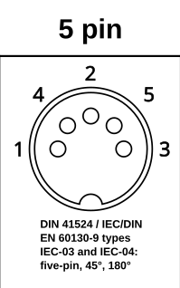
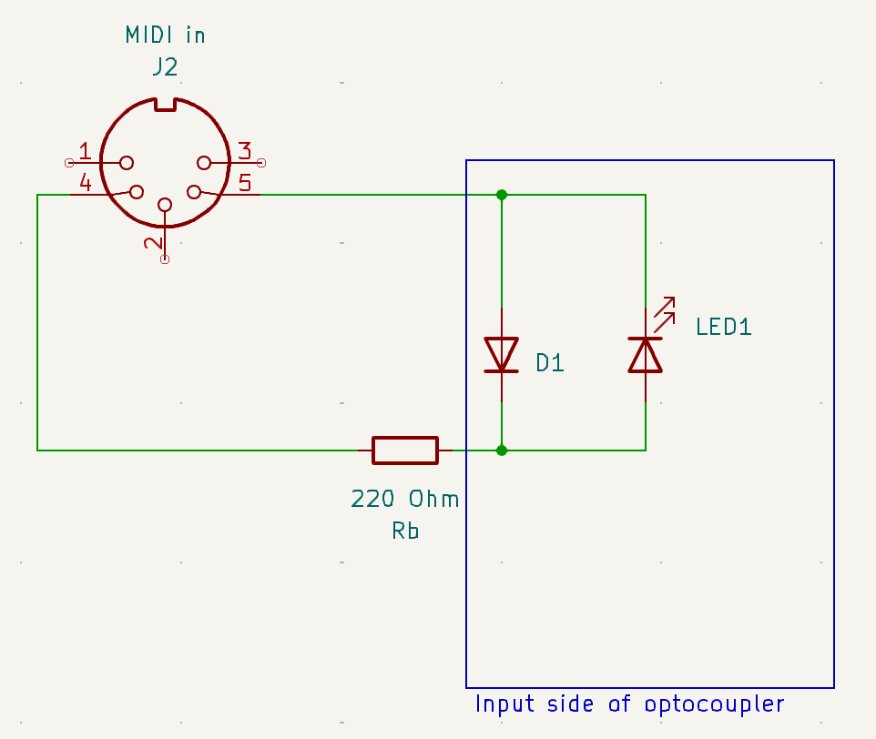
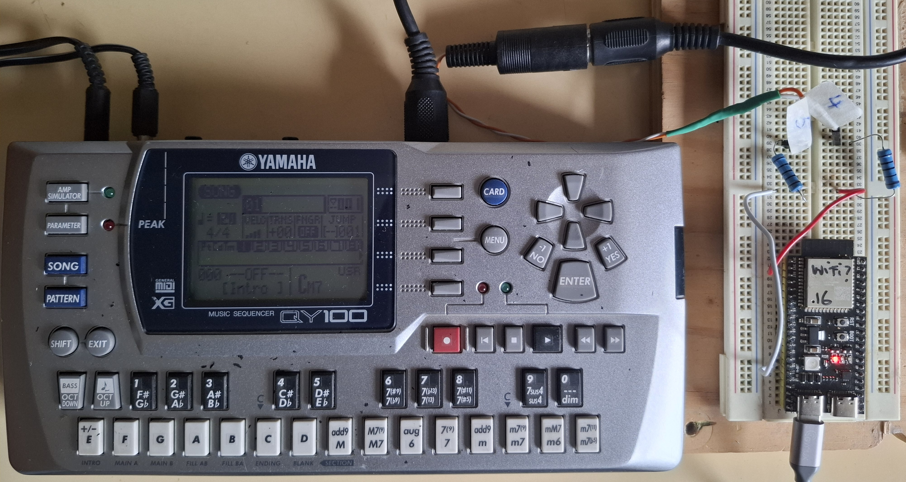

# MIDI over serial output with ESP32 and MicroPython

# Contents
1.  [Overview](#1-overview)
2.  [Parts list](#2-parts-list)
3.  [MIDI over serial and DIN connector](#3-midi-over-serial-and-din-connector)
4.  [Circuit](#4-circuit)
5.  [The program](#5-the-program)
6.  [The receiving end](#6-the-receiving-end)
7.  [Some tinkering and testing](#7-some-tinkering-and-testing)
     * [ESP32 GPIO pin drive strength](#esp32-gpio-pin-drive-strength)
     * [Testing](#testing)
     * [And what happens with a logical 0?](#and-what-happens-with-a-logical-0)
     * [Open drain](#open-drain)
8.  [Can I burn or damage the ESP32 or the receiver?](#8-can-i-burn-or-damage-the-esp32-or-the-receiver)
9.  [Troubleshooting](#9-troubleshooting)
10.  [Is this possible on a RP2040?](#10-is-this-possible-on-a-rp2040)
11.  [Links](#11-links)
     * [MIDI CA-033 standard](#midi-ca-033-standard)
     * [ESP32 datasheet](#esp32-datasheet)
     * [MicroPython ESP32 docs](#micropython-esp32-docs)
     * [ESP32 technical reference manual](#esp32-technical-reference-manual)
     * [Raspberry Pi Pico datasheet](#raspberry-pi-pico-datasheet)
     * [MIDI connector pinout](#midi-connector-pinout)
     * [The QY100 sound module](#the-qy100-sound-module)
# 1. Overview

MIDI data can be sent over a serial connection. This is done with  5 pin 180&#176; DIN connectors:


This document explains how to play MIDI files on a ESP32 and drive a sound module with a 5 pin DIN MIDI connector.

This description is valid both for the ESP32 and the ESP32-S3 microcontrollers.

# 2. Parts list

* One 33 Ohm resistor
* One 10 Ohm resistor
* One 5 pin 180&#176; DIN male connector

You also can connect the ESP32 to a female connector and use a 5 pin DIN male to male cable to connect to the sound module.


# 3. MIDI over serial and DIN connector

The MIDI signal over a DIN connector needs no current (0 mA) for a logical 1 and 5 mA for a logical 0.

Since the serial protocol is normally on (i.e. normally transmitting logical 1), current is zero while idle.

The signal is transmitted through pins 4 and 5 of the 5 pin DIN connector. This is valid both for male and female connectors. 

Here is the pin numbering. This is the front side (socket side, connector side, external side) for a female plug, or solder side (internal side) for a male plug:



Please note that there are some incorrect pinout diagrams out there on internet. See [here](#midi-connector-pinout) for some good links. 

# 4. Circuit

The circuit to connect to MIDI out is this:


It's based on the circuit [MIDI 2014 CA-033 standard](#midi-ca-033-standard).

You need to connect the GPIO output pin of the ESP32 to Rc = 10 Ohm and then to the pin 5 of the DIN connector, and the 3.3V pin of the ESP32 to the Ra = 33 Ohm pin and to the pin 4 of the DIN connector.

No additional buffer, driver or voltage shifter is needed. The ESP32 GPIO pins supply more than enough energy to make this work.

Pins 1, 2 and 3 of the MIDI plug are not connected. Pin 2 and shielding is needed if cables are long, see the [MIDI 2014 CA-033 standard](#midi-ca-033-standard).


# 5. The program

To play back a MIDI file, use this MicroPython code on the ESP32. ```my_midi_file.mid```  needs to be on the root of the ESP32's file system. Use ```mpremote cp my_midi_file.mid :/" to copy the MIDI file from your PC to the root of the microcontroller's file system.

You also must install ```umidiparser```, see https://github.com/bixb922/umidiparser?tab=readme-ov-file#installation 

Put the following code into a file ```midi_test.py``` and run with ```mpremote run midi_test.py``` with the microcontroller connected to the USB port of the PC. You can certainly also use an IDE like Viper IDE or Thonny instead of the command line ```mpremote```.

```
from machine import UART
from umidiparser import MidiFile

uart = UART( 1, baudrate=31250, tx=10, rx=9 )

for event in MidiFile("my_midi_file.mid").play():
    if event.is_channel():
        uart.write( event.to_midi() )
```

First a UART (Universal Asynchronous Receiver Transmitter) is initialized on pin 10 for transmission. The UART hardware in the ESP32 solves the serialization of the information to be transmitted. Pin 9 for reception must be defined although it is not used. Baudrate is the transmission speed, it must be 31250 for MIDI. 

The MidiFile.play() method is a generator that waits for the next event to be due, and then returns the next MIDI event in the file. MIDI files normally have "meta events" that contain information such as track name or lyrics. They are not needed for playback. Only the so-called "channel events" are needed for playback. The MidiEvent.to_midi() method forms the MIDI message to be sent over the MIDI out. These output messages are very short, either 2 or 3 bytes.

See ```uart-midi.py``` in this repository for a more complete source code.

Don't use UART0, it is reserved for the REPL. See the [MicroPython docs](#micropython-esp32-docs) for the default pins for UART 1 and 2, but you can select almost any pin. 


# 6. The receiving end

This is the receiving end of the circuit (i.e. this is what's behind a ```MIDI in```plug):



There is always Rb, a 220 Ohm resistor on the receiving end to limit current. The diode D1 kicks in when pin 4 and 5 are accidentally reversed to protect the LED, i.e. reversing pins 4 and 5 accidentally does no damage to neither end. The current drives LED1 in a optocoupler. The purpose of the optocoupler is to isolate this circuit electrically from the rest of the receiver. The optocouplers are normally 6N138, 6N139, PC-900V or H11L1 integrated circuits.

When LED1 has a current of around 5 mA, it will act on a photosensitive device that then switches a current on and off in the receiver.


# 7. Some tinkering and testing

## ESP32 GPIO pin drive strength

The ESP32 pins allow to set the drive strength:

| drive= | maximum current | internal resistance
|--------|-----------------|--------------------|
| ```Pin.DRIVE_0```| 5mA | 130 ohm|
| ```Pin.DRIVE_1```| 10mA | 60 ohm|
| ```Pin.DRIVE_2```| 20mA | 30 ohm (default strength if not configured)|
| ```Pin.DRIVE_3```| 40mA | 15 ohm|

The equivalent circuit modeling the drive strength is as follows:


The equivalent circuit is drawn for logical 0, i.e. current is flowing. The typical voltage drop on LED1 is 1.4V and D1 is open (not shown here), so the circuit equation is:

(R<sub>drive</sub> + R<sub>a</sub> + R<sub>c</sub> + R<sub>b</sub>)&times;_I_ + V<sub>LED1</sub> = 3.3

Solving for the current _I_, and setting V<sub>LED1</sub> = 1.4, R<sub>b</sub>=220Ohm

_I_ = 1.9/(R<sub>drive</sub> + R<sub>a</sub> + R<sub>c</sub> + 220)

Here is a little table with the current _I_ for various drive strength and resistors, all with a typical value 1.4V of V<sub>LED1</sub>:

R<sub>a</sub>|R<sub>c</sub>  |Drive|R<sub>drive</sub>|_I_ [mA]|
--|----|-|--|---|
33|10  |2|30|6.5|
33|10  |3|15|6.8|
50|50  |2|30|5.4|
50|50  |3|15|5.7|
100|100|2|30|4.2|
100|100|3|15|4.4|

I found that R<sub>a</sub>=R<sub>c</sub>=100 Ohm and drive=3 works for my case and offers more protection than 33+10 Ohm. I think that those values should work for almost all MIDI devices. 4.4mA is slightly below the standard, but LED1 needs at most 2.5 or 3 mA.

To set the drive strength, this is the MicroPython code:
```
from machine import UART, Pin
uart = UART( 1, baudrate=31250, tx=Pin(10,Pin.OUT,drive=Pin.DRIVE_3), rx=9 )
```

## Testing

Here is my test setup. I have a  [Yamaha QY100](#the-qy100-sound-module) sound module which I used for testing. The microcontroller is a ESP32-S3 on a DEVKIT-C board. Just for precaution, I used an suspect ESP32-S3 too, but I didn't burn anything in the process &#128540; yay!



Wiring goes from pin 10 to the blue 100 Ohm resistor (white), then to pin 5 of the DIN connector, pin 4 to the other blue 100 Ohm resistor and (red) back to 3.3V of the microcontroller's board. No special setup was necessary on the QY100, but it has a sliding switch to select the MIDI source which had to be set to MIDI.

So now the sound module is playing back a nice march, one of my crank organ MIDI files &#x1F603;&#x1F603;&#x1F603;

I tested this circuit also on my Nord Stage keyboard, no problem. No special setting was needed for the MIDI output to sound.

## And what happens with a logical 0?

Just for completeness: when the signal is logical 1, the GPIO pin outputs a voltage of 3.3V minus about 3mV. The measured current is nearly zero, so LED1 will produce no light and the optocoupler will be turned off. 

## Open drain

The MIDI standard hints at open collector or open drain drivers, but does not mandate them. I measured the circuit with the Pin.OPEN_DRAIN mode, and there is no advantage in using open drain output with the ESP32.

# 8. Can I burn or damage the ESP32 or the receiver?

MIDI connections are designed to be very sturdy and to resist a lot of abuse. On stage, but also in a studio, many bad things can happen...

These situations work well with this circuit:
* If you plug in this ```MIDI out``` to another ```MIDI out``` instead to a ```MIDI in```, nothing bad will happen, as long as the other ```MIDI out```is idle.
* If pins 4 and 5 get accidentally reversed, nothing bad will happen. D1 on the receiving side will absorb the reversed current nicely.


These situations should be avoided:
* If you plug this circuit to a ```MIDI out``` by error, **and** if the other ```MIDI out``` starts to transmit, 5V might leak back to the ESP32 and there is no protection for that.
* If pins 4 and 5 get accidentally shorted, **and** the ESP32 starts to transmit, the current that will flow is about 60 mA which is too high for the ESP32. That's why I prefer slightly higher resistors.
* If you use long MIDI cables, see the [MIDI CA-033 standard](#midi-ca-033-standard) for shielding and use of pin 2 to get protection against RFI (Radio Frequency Interference).

The module that is receiving the information has a optocoupler as an input, as mandated by the MIDI standard. This receiving circuit is rather sturdy and can tolerate some abuse.

# 9. Troubleshooting

* Make sure pin 4 and 5 are not reversed
* Check all connections again
* Make sure baud rate is 31250
* Make sure that it's the correct pin number (the silk screen number on the DEVKIT board)

To measure the circuit, this little MicroPython program helps:
```
from machine import Pin
upin = Pin(10, mode=Pin.OUT)
while True:
    print("111111111111111")
    upin.value(1)
    time.sleep(5)
    print("0")
    upin.value(0)
    time.sleep(5)
```
This program will alternate on and off states with enough time for a cheap digital multimeter (as the one I have) to settle. The program will do no harm to the ```MIDI in``` on the sound module.

To measure the current that is flowing, you can measure the voltage at R<sub>c</sub> and divide that by the resistor value. With a 10 Ohm resistor, the reading should alternate between 0 mV (for a logical 1) and 0.05V (50 mV, for a logical 0). With a 100 Ohm resistor, the reading should switch between 0 mV and 0.5V (500 mV).

The voltage between the output pin and ground (GND) should switch between about 3.25V and 0.15V.

To measure the voltage between pins 4 and 5, put the red terminal of the multimeter to pin 4 and the black terminal to pin 5. The high voltage between pins 4 and 5 should be between 2.1V and 2.8V. The low voltage between pins 4 and 5 should be 0 to 5 milliVolts. In both cases there should be a positive reading.

# 10. Is this possible on a RP2040?

I haven't tried it. The RP2040 allows a maximum current of 4mA per pin, and here 5mA are needed, so the current must be limited with higher resistances.

This article shows how to set the RP2040 to a higher current, similar to the drive= parameter on the ESP32 pins:

https://www.reddit.com/r/raspberrypipico/comments/10zbe89/micropython_drive_strength_for_gpio/

That post says that "the pad control registers start at 0x4001c000 and can be manipulated using mem32. See page 299 in the datasheet. The following sets pin 16 to 12ma drive: ```mem32[0x4001c044] = mem32[0x4001c044] | 0b0110000```

With a drive current of 12ma, it should be possible to make the circuit work.

# 11. Links

## MIDI CA-033 standard
This 2014 update of the standard describes in detail how to connect a 3.3V output to MIDI. The circuit here is copied from the standard:

https://midi.org/5-pin-din-electrical-specs


## ESP32 datasheet
The datasheet of the ESP32 with maximum currents:

https://www.espressif.com/sites/default/files/documentation/esp32_datasheet_en.pdf

## MicroPython ESP32 docs
MicroPython documentation for Pin and UART objects. Also shows the internal resistance with different drive strengths:

https://docs.micropython.org/en/latest/esp32/quickref.html

## ESP32 technical reference manual
ESP32 technical reference manual, see section "Peripheral output via GPIO Matrix":

https://www.espressif.com/sites/default/files/documentation/esp32_technical_reference_manual_en.pdf

## Raspberry Pi Pico datasheet
Datasheet of the Raspberry Pi Pico, see "2.19.6.3. Pad Control - User Bank" for drive currents:

https://datasheets.raspberrypi.com/rp2040/rp2040-datasheet.pdf

## MIDI connector pinout

The DIN 5 pin MIDI connector follows standards DIN 41524 and IEC/DIN EN60139-9 types IEC-03 and IEC-04. Here is information on the DIN connectors:

https://en.wikipedia.org/wiki/DIN_connector

Here is the pinout diagram showing pin numbering for socket/connector/external side for female or solder/internal side for male plug:

https://en.wikipedia.org/wiki/DIN_connector#/media/File:DIN_connector_pinout.svg

This link is also interesting:

https://learn.sparkfun.com/tutorials/midi-tutorial/hardware--electronic-implementation

It seems I wasn't the only one to get confused with pin numbering:

https://midi.org/community/midi-connections/confusion-with-5-pin-din-terminal-numbering

https://www.theatreofnoise.com/2017/08/midi-wiring-diagrams.html


## The QY100 sound module

This module was released in 1998. Still working nicely, it's really a complete MIDI workstation!

https://synthpedia.net/yamaha/qy100
